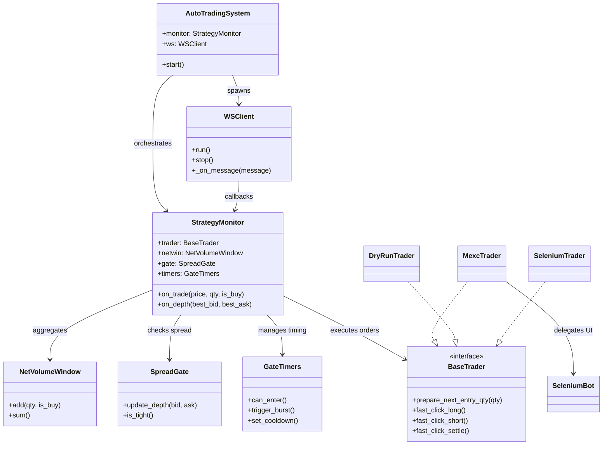
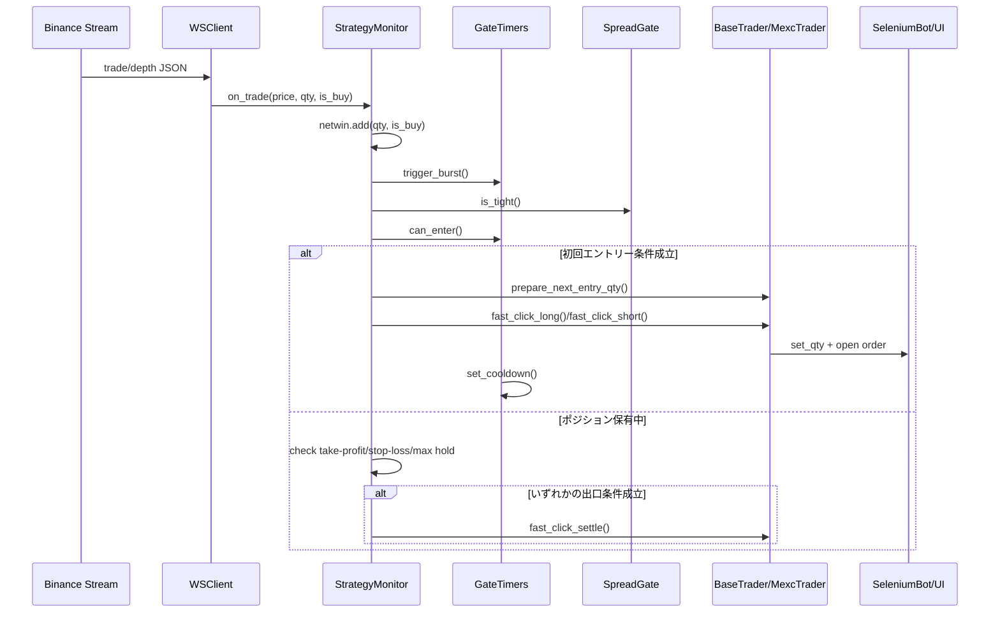

# MEXCbot 初心者向け解説ドキュメント
- where: doc/mexcbot_beginner_guide.md
- what: MEXCbot の構成と保護ロジックを初心者向けに整理したガイド
- why: 新規メンバーが安全にコードを理解し調整できるようにする

最終更新: 2025-09-28

## 1. システム全体像
MEXCbot は Binance の WebSocket 市場データを監視し、条件が揃えば MEXC の UI を操作して超短期取引を行うボットです。実行レイヤは Selenium を使った UI 自動化で、コア戦略は Python で記述されています。

### 1.1 コア戦略 (`mexcbot_core.py`)
- **`StrategyMonitor`** (`mexcbot_core.py:171`): 入力データを集約し、エントリーとエグジットの判断を下す中心クラス。
- **`NetVolumeWindow`** (`mexcbot_core.py:124`): 直近 `TIGHT_GATE_WINDOW_SEC` 秒の出来高を符号付きで積算し、買い優勢/売り優勢を判定。
- **`SpreadGate`** (`mexcbot_core.py:145`): 板の最良気配差が `SPREAD_TIGHT_USD` 以下かどうかをチェック。
- **`GateTimers`** (`mexcbot_core.py:156`): クールダウンや連打抑制など、時間制御の役割を担当。
- **`WSClient`** (`mexcbot_core.py:236`): Binance WebSocket (`BINANCE_WS_URL`) からティックと板情報を取得して `StrategyMonitor` に渡すスレッド。
- **`AutoTradingSystem`** (`mexcbot_core.py:283`): 戦略と WebSocket クライアントを束ね、実行ループを提供。

### 1.2 UI 実行レイヤ (`mexcbot_executor.py`)
- **`SeleniumBot`**: 既に起動している Chrome (リモートデバッグポート `127.0.0.1:9222`) に接続し、数量入力やロング/ショート/クローズボタンを操作します。
- DryRun モードでは `DryRunTrader` (`mexcbot_core.py:55`) が疑似的にログを出し、本番環境に手を出さずに動作検証が可能です。

## 2. データフローと実行ステップ
1. `WSClient` が Binance から `@trade` / `@aggTrade` / `@depth5@100ms` のストリームを受信します (`mexcbot_core.py:239-265`)。
2. 取引ティックは `StrategyMonitor.on_trade` (`mexcbot_core.py:182`) に渡され、出来高ウィンドウと時間ゲートが更新されます。
3. 板更新は `StrategyMonitor.on_depth` (`mexcbot_core.py:203`) に渡され、最新の最良気配が `SpreadGate` に保存されます。
4. エントリー条件が揃うと `_enter` (`mexcbot_core.py:206`) が呼ばれ、Selenium 経由で発注。ポジション保有中は `_should_take_profit` (`mexcbot_core.py:223`)、`_should_stop_loss` (`mexcbot_core.py:227`)、`_max_hold_elapsed` (`mexcbot_core.py:231`) などで出口戦略をチェックします。
5. エグジット時には `_exit` (`mexcbot_core.py:214`) が数量確定とポジションリセットを行い、クールダウンタイマーが更新されます。

## 3. 重要な安全設計
### 3.1 板やスプレッドの質でふるい落とす
- `SpreadGate.is_tight()` (`mexcbot_core.py:148-152`) は最良買い・売りの差が `SPREAD_TIGHT_USD` (初期値 0.00020 USD) 以下の場合だけを「板が良い状態」とみなし、その他の状況ではエントリーを抑制します。
- `StrategyMonitor` からのエントリー判断でも `self.gate.is_tight()` を必須条件にしているため (`mexcbot_core.py:186-189`)、スプレッドが広がった瞬間は自然に見送りとなります。

### 3.2 クールダウンで再突入の負の連鎖を防ぐ
- `GateTimers.set_cooldown()` (`mexcbot_core.py:166`) は約定直後に `COOLDOWN_SEC` (初期値 8 秒) の待機時間を設定し、この間は `can_enter()` (`mexcbot_core.py:161`) が `False` を返すため再エントリーを禁止します。
- さらに `GateTimers.trigger_burst()` (`mexcbot_core.py:164`) により「最近ティックが来たか」をフラグ管理し、`can_enter()` で "エントリー判断は最新ティックから `TIGHT_GATE_WINDOW_SEC` 秒以内" という条件も課しています。これにより取引後の板薄状態での連打が起こりにくくなります。

### 3.3 時間帯ごとに閾値を最適化する
- 現行コードには時間帯で `NET_ENTRY` や `SPREAD_TIGHT_USD` を自動切り替えする仕組みはまだ実装されていません。全時間帯で単一の閾値を使用しています。
- 改善案としては、`datetime.utcnow()` などで時間帯を判定し、`StrategyMonitor` に時間帯別係数を渡す、あるいは `config.py` に時間別テーブルを持たせるといったアプローチが考えられます。調整する際はクールダウンや出口条件とセットで再検証してください。

### 3.4 出口戦略（保持時間など）を工夫する
- 3 種類の出口条件が同時に監視され、どれか 1 つでも満たせば即時決済します。
  - **利確**: `TAKE_PROFIT_PCT` (0.001 = 0.1%) を超える含み益で `_should_take_profit()` が `True` (`mexcbot_core.py:223-225`)。
  - **損切り**: `STOP_LOSS_PCT` (0.00045 = 0.045%) を超える含み損で `_should_stop_loss()` (`mexcbot_core.py:227-229`)。
  - **時間切れ**: `MAX_HOLD_SEC` (5 秒) を超える保有で `_max_hold_elapsed()` (`mexcbot_core.py:231-233`)。
- `_exit()` は必ず `fast_click_settle()` を呼び、建玉を閉じた後にポジション情報とクールダウンをリセットします (`mexcbot_core.py:214-219`)。保持時間を伸ばす場合は対となる損切り幅・クールダウンも調整するのが安全です。

## 4. 初心者向けチェックリスト
- Chrome をリモートデバッグモードで起動 (`chrome.exe --remote-debugging-port=9222`) し、Selenium が接続できる状態にしてから `AutoTradingSystem` を実行します。
- 最初は `USE_SELENIUM = False` にし、`DryRunTrader` でログのみを確認するのがおすすめです (`mexcbot_core.py:44-76`)。
- 実行するときは `.venv` を有効化し、`websocket-client` や `selenium` がインストールされていることを確認します。
- パラメータを変更したら、バックテストやペーパートレードで挙動を再確認します。特に `NET_ENTRY` / `NET_EXIT` と `COOLDOWN_SEC` の組み合わせはトレード頻度に大きく影響します。

## 5. よく使う調整ポイント
| 定数 | 役割 | 初期値 | 調整の目安 |
| ## 9. 実行手順
1. 仮想環境を有効化します。
   ```powershell
   venv\Scripts\activate
   ```
2. faulthandler と UTF-8 強制などのオプションを有効にした状態でコアを起動します（仮想環境を経由するため `python` を使います）。
   ```powershell
   python -X faulthandler -X utf8 -u mexcbot_core.py
   ```
--- | ## 9. 実行手順
1. 仮想環境を有効化します。
   ```powershell
   venv\Scripts\activate
   ```
2. faulthandler と UTF-8 強制などのオプションを有効にした状態でコアを起動します（仮想環境を経由するため `python` を使います）。
   ```powershell
   python -X faulthandler -X utf8 -u mexcbot_core.py
   ```
--- | ## 9. 実行手順
1. 仮想環境を有効化します。
   ```powershell
   venv\Scripts\activate
   ```
2. faulthandler と UTF-8 強制などのオプションを有効にした状態でコアを起動します（仮想環境を経由するため `python` を使います）。
   ```powershell
   python -X faulthandler -X utf8 -u mexcbot_core.py
   ```
--- | ## 9. 実行手順
1. 仮想環境を有効化します。
   ```powershell
   venv\Scripts\activate
   ```
2. faulthandler と UTF-8 強制などのオプションを有効にした状態でコアを起動します（仮想環境を経由するため `python` を使います）。
   ```powershell
   python -X faulthandler -X utf8 -u mexcbot_core.py
   ```
--- |
| `NET_ENTRY` (`mexcbot_core.py:26`) | エントリー閾値 (出来高の偏り) | 800 | 値を上げると慎重に、下げると頻度増。
| `NET_EXIT` (`mexcbot_core.py:27`) | エグジット用の逆方向閾値 | 752 | 高めにすると含み損許容を広げる。
| `SPREAD_TIGHT_USD` (`mexcbot_core.py:28`) | 許容スプレッド幅 | 0.00020 | スプレッドが広い通貨では緩める必要あり。
| `COOLDOWN_SEC` (`mexcbot_core.py:33`) | 再エントリー待機時間 | 8.0 | 市況が速い場合は短く、遅い場合は長く。
| `MAX_HOLD_SEC` (`mexcbot_core.py:31`) | 最大保有時間 | 5.0 | ボラティリティが高い時間帯は延長を検討。

## 6. 今後の改善アイデア
- 時間帯別パラメータの適用 (例: ロンドン/NY の重なる 16:00-20:00 UTC は `NET_ENTRY` を引き上げる)。
- `SeleniumBot.is_position_open()` の未実装部分補完や、約定確認の堅牢化。
- 指値等への拡張を行う場合は、現在のクールダウンと出口設計との整合性を必ず検証してください。

## 7. Mermaid 図で理解する

### 7.1 クラス図


### 7.2 シーケンス図（ティック受信から約定まで）


## 8. 環境セットアップとライブラリ管理
1. Python 3.11 が入っていることを前提に、プロジェクトルートで仮想環境を作ります。
   ```powershell
   py -3.11 -m venv venv
   ```
2. 仮想環境を有効化します。PowerShell の場合は `.\venv\Scripts\Activate.ps1`、コマンドプロンプトなら `venv\Scripts\activate` を実行してください。
   ```powershell
   .\venv\Scripts\Activate.ps1
   ```
3. 仮想環境内の pip を最新版に更新します。
   ```powershell
   python -m pip install --upgrade pip
   ```
4. 用意済みの `requirements.txt` から依存パッケージをインストールします。
   ```powershell
   pip install -r requirements.txt
   ```
5. 作業後に仮想環境を抜けるときは以下を実行します。
   ```powershell
   deactivate
   ```

> Selenium はローカルの Chrome/ChromeDriver を使用するため、ブラウザのバージョンに合わせたドライバを用意してください。
## 9. 実行手順
1. 仮想環境を有効化します。
   ```powershell
   venv\Scripts\activate
   ```
2. faulthandler と UTF-8 強制などのオプションを有効にした状態でコアを起動します（仮想環境を経由するため `python` を使います）。
   ```powershell
   python -X faulthandler -X utf8 -u mexcbot_core.py
   ```
---
このドキュメントは、まず DryRun で安全に挙動を確認し、保護ロジックの意味を理解したうえで本番投入するためのガイドとして活用してください。


